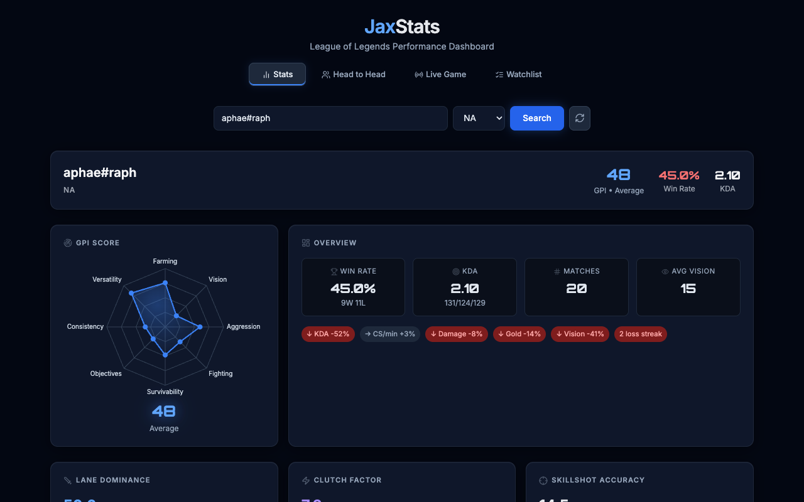
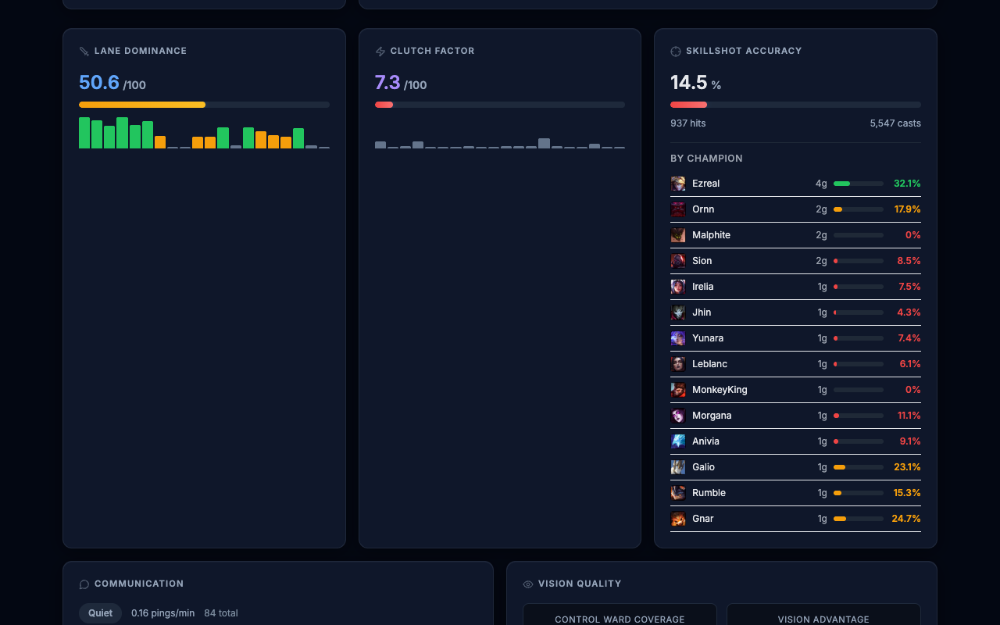
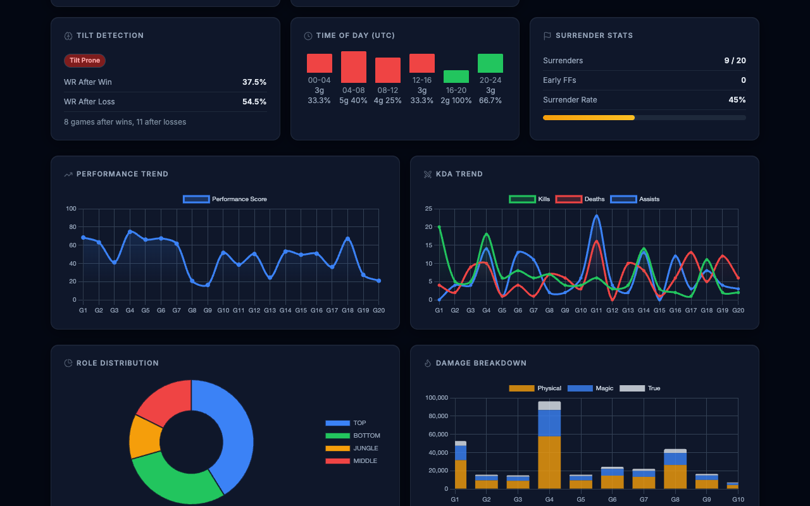
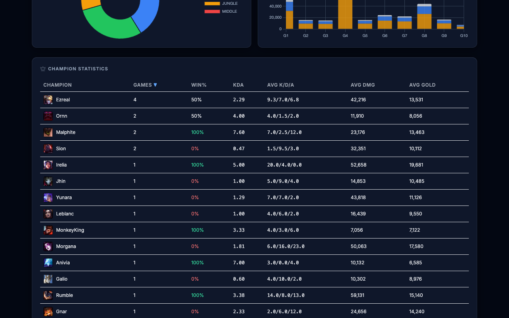
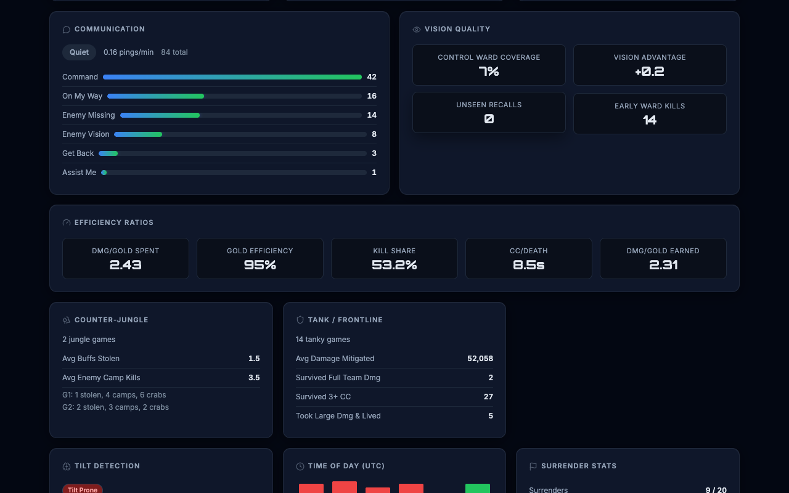

# JaxStats

A League of Legends performance analysis dashboard built with FastAPI and XGBoost. Fetches match data from the Riot Games API and provides ML-powered performance scoring, an 8-skill GPI (Gamer Performance Index) breakdown, and optional AI coaching suggestions via Ollama.

## Features

- **Summoner Stats** — match history analysis with per-match ML scoring and tier prediction
- **GPI Radar** — 8-skill performance profile (farming, vision, aggression, fighting, survivability, objectives, consistency, versatility)
- **Charts** — performance trend, KDA trend, role distribution, damage breakdown (Chart.js)
- **Champion Stats** — per-champion win rate, KDA, damage, and gold averages
- **Head-to-Head** — side-by-side summoner comparison with stat bars and GPI overlay
- **Live Game** — 5v5 team display with each player's recent GPI and win rate
- **AI Coaching** — match improvement suggestions via Ollama (llama3) with rule-based fallback
- **Dark gaming dashboard** theme inspired by op.gg / Mobalytics

## Screenshots

### Stats Dashboard
GPI radar, overview cards, win rate, KDA, and trend indicators at a glance.



### Advanced Stats
Lane dominance, clutch factor, skillshot accuracy, and per-champion breakdown.



### Performance Charts
Performance trend, KDA trend, role distribution, damage breakdown, tilt detection, and surrender stats.



### Champion Statistics
Sortable table with win rate, KDA, damage, and gold averages per champion.



### Detailed Analytics
Communication patterns, vision quality, and efficiency ratios.



## Setup

```bash
python -m venv .venv
source .venv/bin/activate
pip install -r requirements.txt
cp .env.example .env   # Add your RIOT_API_KEY
uvicorn app.main:app --reload
```

Open http://localhost:8000.

### Train ML Models

Models are pre-trained in `app/ml/models/`. To retrain on new cached match data:

```bash
python -m app.ml.train
```

### Environment Variables

| Variable | Required | Default | Description |
|----------|----------|---------|-------------|
| `RIOT_API_KEY` | Yes | — | Riot Games API key |
| `OLLAMA_BASE_URL` | No | `http://localhost:11434` | Ollama server URL |
| `OLLAMA_MODEL` | No | `llama3` | Ollama model name |

## Docker

```bash
docker build -t jaxstats:local .
docker run -p 8000:8000 -e RIOT_API_KEY=your_key jaxstats:local
```

## API Endpoints

| Endpoint | Method | Description |
|----------|--------|-------------|
| `/api/analyze/{summoner}` | GET | Full stats analysis with GPI and ML scores |
| `/api/gpi/{summoner}` | GET | GPI breakdown only |
| `/api/live-game/{summoner}` | GET | Live game with player GPI |
| `/api/match-timeline/{match_id}` | GET | Match timeline events |
| `/api/champion-stats/{summoner}` | GET | Per-champion breakdown |
| `/api/compare` | POST | Head-to-head comparison |
| `/health` | GET | Service health check |

## License

MIT
